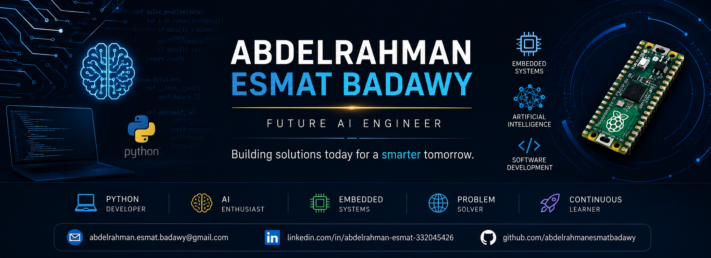

  

<h1 align="center">Hi 👋, I'm Abdelrahman Esmat Badawy Khalifa</h1>

<h3 align="center">
Future Computer Science & Artificial Intelligence Student
</h3>

A passionate Egyptian student interested in Artificial Intelligence, Software Development, Embedded Systems and solving real-world problems through technology.

---

## 🚀 About Me

- 🎓 Egyptian High School Graduate (Scientific Mathematics)
- 💻 Future Computer Science & Artificial Intelligence Student
- 🐍 Passionate Python Programmer
- 🤖 Interested in Artificial Intelligence & Machine Learning
- ⚙️ Exploring Embedded Systems & Raspberry Pi Pico
- 📚 Constant learner who enjoys building practical projects
- 🌍 Seeking international scholarships and research opportunities

---

# 💻 Tech Stack

---

# 🎯 Current Goals

- 🚀 Build real-world Python projects
- 🤖 Learn Machine Learning
- 🧠 Study Deep Learning
- 💡 Participate in programming competitions
- 🌍 Win an international scholarship
- 📚 Study Computer Science abroad
- ❤️ Contribute to Open Source

---

# 🏆 Achievements

- 🥇 Multiple Academic Excellence Awards
- 🥇 School Programming Activities
- 🥇 STEM & AI Workshops
- 🥇 School Theatre & Presentation Activities
- 🥇 Team Competitions
- 🥇 Python Learning Projects

---

# 📂 Featured Projects

### 🐍 Python Calculator

A desktop calculator built with Python.

---

### 📊 Student Grade Management System

Python application for managing students' grades.

---

### 🤖 AI Mini Projects

Simple Artificial Intelligence experiments and exercises.

---

### ⚙ Raspberry Pi Pico Projects

Embedded systems projects using MicroPython.

---

### 🌐 Personal Portfolio

Professional portfolio and academic documents.

---

# 📖 Currently Learning

- Python Advanced Programming

- Data Structures

- Algorithms

- Artificial Intelligence

- Machine Learning

- Git & GitHub

- Software Engineering

---

# 🎓 Education

**Secondary School**

Al Radwa Language Schools

6th of October City

Egypt

(Expected Graduation 2026)

---

# 🌍 Languages

🇪🇬 Arabic — Native

🇬🇧 English — Very Good (Improving toward Academic Fluency)

---

---

# 📊 GitHub Statistics

# 📫 Connect with Me

📧 Email

**abdelrahman.esmat.badawy@gmail.com**

💼 LinkedIn

https://linkedin.com/in/abdelrahman-esmat-332045426

💻 GitHub

https://github.com/abdelrahmanesmatbadawy

---

⭐ Thanks for visiting my profile!

If you like my work, don't forget to star my repositories.

